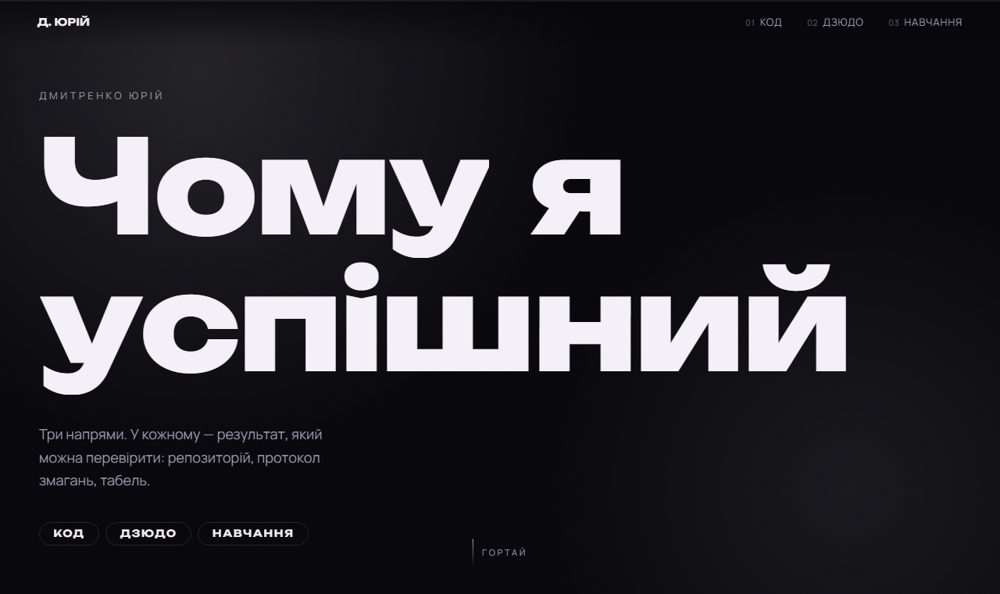

# Чому я успішний

<!-- badges -->
[](https://github.com/YuraItDeveloper14/chomu-ya-uspishnyi/actions/workflows/check.yml) [](LICENSE) [](https://github.com/YuraItDeveloper14/chomu-ya-uspishnyi/commits)

<!-- preview -->
<p align="center">
  
</p>

A one-page site about the three things I do in parallel: code, judo and school.
Each part has its own colour world, and the page shifts between them as you scroll.

**Live:** [chomu-ya-uspishnyi.vercel.app](https://chomu-ya-uspishnyi.vercel.app)

## What is in it

- Three colour worlds — violet for code, amber for judo, green for school — chosen by
  whichever section holds the middle of the screen
- Headings that assemble letter by letter, count-up numbers, gentle parallax on photos
- A lightbox for the photos, so the report card can actually be read
- Respects `prefers-reduced-motion`: no animation for people who have turned it off

Plain HTML, CSS and JavaScript. No framework, no build step, no dependencies.

## Running it

```bash
python -m http.server 8000 --directory public
```

Then open http://localhost:8000.

## Layout

```
public/
  index.html   markup and copy
  style.css    colour worlds, type, layout
  script.js    reveal, counters, world switching, parallax, lightbox
  img/         photos
vercel.json    cache headers for images
```

## Licence

Code — MIT, see [LICENSE](LICENSE). The photos are personal and are not covered by the licence.
